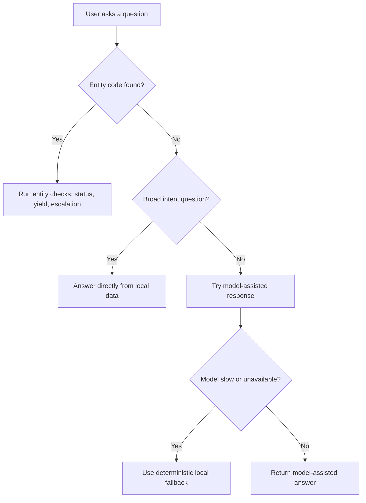
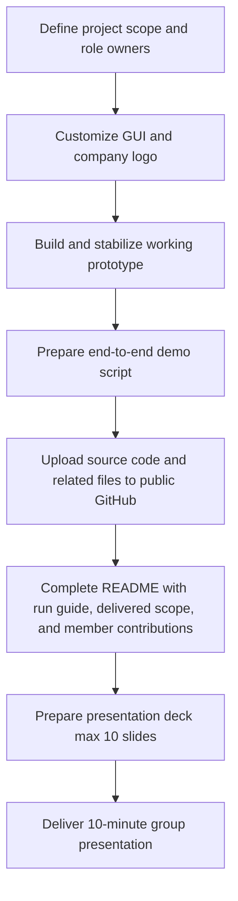

# Equipment Performance Sustaining Chatbot (TCB Factory Agent)

This document is written for both non-coders and developers.

## What this app does (plain language)

This app is a factory support chatbot.
It helps users quickly answer questions like:

- Which tools are down right now?
- Which entity has low yield?
- Should this entity be escalated?

The app reads local project data files and gives structured answers.
It can also keep short conversation memory so follow-up questions make sense.

## Who this is for

- Operations users who need status and escalation answers
- Supervisors who want quick summary checks
- Project team members demonstrating a working AI prototype

## What data it uses

The chatbot reads only local files in the `data/` folder:

- `data/status.csv`
- `data/mtp.csv`
- `data/yield.csv`
- `data/*.pdf`, `data/*.xlsx`, `data/*.txt`, `data/*.md` (manuals and references)

No external factory system updates are performed.
Ticket creation is simulated inside the app memory.

## How the chatbot answers questions



## Quick start for non-coders

1. Open this project folder in VS Code.
2. Open Terminal in VS Code.
3. Run the commands below one by one.

```bash
pip install -r requirements.txt
copy .env.example .env
```

4. Open `.env` and add your API key value for `OPENAI_API_KEY`.
5. Start the app:

```bash
python -m streamlit run chat_ui.py
```

6. Open the shown local URL in your browser (usually `http://localhost:8501`).

## Example questions you can try

- `what tools is down`
- `which entity has the lowest yield`
- `tell me about TCB706`
- `should TCB706 be escalated`
- `what tools are underperforming`

## Commands inside the app

Type these in the chat box:

- `/help` - show available commands
- `/status` - show runtime and data health
- `/rag` - show RAG/index status
- `/reload` - reload local data
- `/reset` - clear current conversation

## What has been delivered

- Working Streamlit chatbot prototype
- Company-branded GUI customization
- Local-data-based status, yield, and escalation logic
- Fallback behavior when model is unavailable
- Conversation memory for better follow-up handling
- Public GitHub repository with source code

## Privacy note

`data/` is git-ignored by default and should stay local when it contains confidential production information.

## Team delegation (Pasted Image 1 requirements)

### Project delivery flow (from pasted image)



| Requirement | Owner | Expected output |
|---|---|---|
| 10-minute presentation, PowerPoint max 10 slides | Tan, Siew Heng | Final slide deck and speaking flow |
| Source code and related files uploaded to public GitHub | Tung, Shi Wah | Public repository with working links |
| Working prototype plus live demo | Hermanto, Ahmad Syauqee | Stable app run and demo script |
| Customized GUI and company logo (starter GUI not used) | Nazari, Yong Amirah | Branded interface aligned to company identity |
| README with run steps, delivered scope, and member contributions | Mohamad Yusoff, Nur Hamizah | Completed README delivery section |

## Team delegation (top knowledge areas)

| Task | Owner |
|---|---|
| Streamlit app development and UX flow | Hermanto, Ahmad Syauqee |
| LangGraph workflow and multi-agent orchestration | Tung, Shi Wah |
| RAG with local factory knowledge/data | Nazari, Yong Amirah |
| Prompt design, fallback behavior, natural intent handling | Tan, Siew Heng |
| Python quality checks, evaluation, and runtime profiling | Mohamad Yusoff, Nur Hamizah |

## Developer appendix

### Optional commands

```bash
python cli.py
python run_demo.py --status
python run_demo.py --graph
python -m pytest tests/test_smoke.py -q
python tests/eval_reasoning.py --count 100
python tests/eval_reasoning.py --count 100 --style natural --attempt-live
```

### Reasoning evaluation

Use `tests/eval_reasoning.py` to benchmark reasoning quality over batch prompts.

- Builds up to 100 prompts from known entities plus a small unknown-entity slice.
- Scores route accuracy, escalation accuracy, grounding coverage, latency, and fallback rate.
- Writes report artifacts to `tests/reports/` as JSON and Markdown.

Example:

```bash
python tests/eval_reasoning.py --count 100 --style natural --attempt-live --out-prefix weekly
```

### Important environment variables

- `OPENAI_API_KEY`
- `CHAT_MODEL`
- `LLM_TIMEOUT_SECONDS`
- `UI_SOFT_TIMEOUT_SECONDS`
- `UI_RESPONSE_CACHE_SIZE`
- `RAG_QUERY_CACHE_SIZE`
- `MANUAL_SEARCH_CACHE_SIZE`
- `ENTITY_CONTEXT_CACHE_SIZE`
- `STATUS_CSV_PATH`
- `MTP_CSV_PATH`
- `YIELD_CSV_PATH`
- `TECHNICIAN_DOCS_DIR`

### Key files

- `factory_agent/graph.py` - status routing and specialist handoffs
- `factory_agent/agents.py` - specialist prompts
- `factory_agent/tools.py` - integrated read/action tools and entity context
- `factory_agent/knowledge_rag.py` - CSV/manual retrieval and query cache
- `factory_agent/manual_data.py` - manual indexing and search cache
- `factory_agent/project_data.py` - status and ticket CSV adapters
- `factory_agent/yield_data.py` - per-entity yield checks
- `chat_ui.py` - Streamlit frontend
